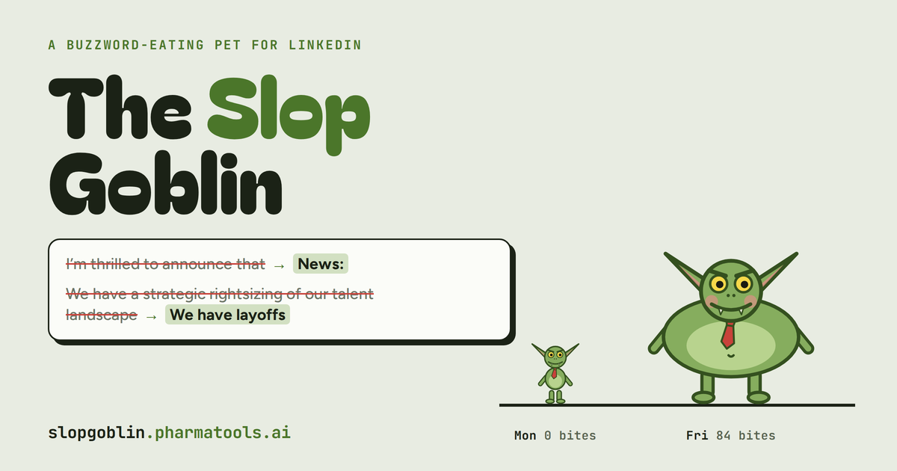
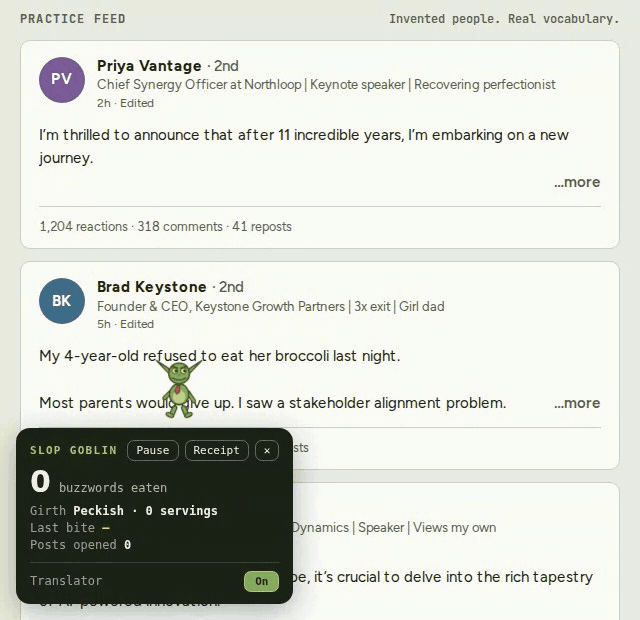
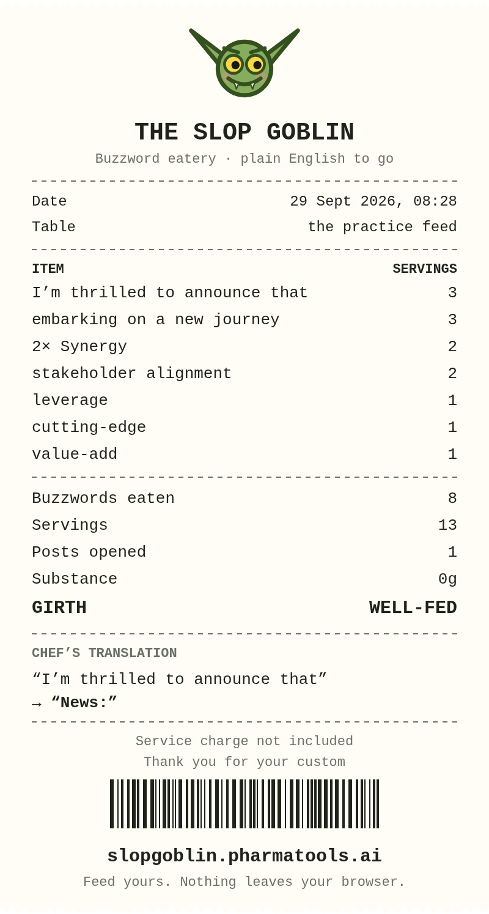
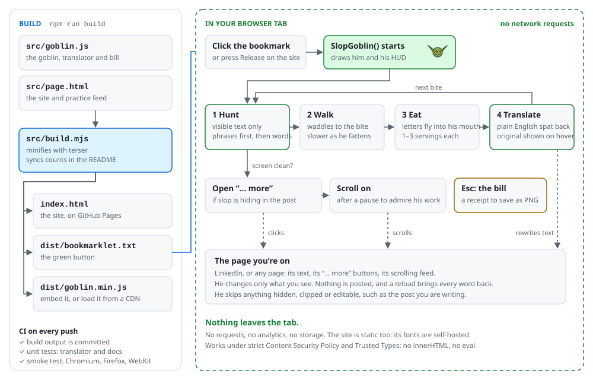

<div align="center">

<a href="https://slopgoblin.pharmatools.ai"></a>

### A goblin that walks down your LinkedIn feed eating buzzwords, gets fatter with every bite, and spits the plain-English version back into the post.

<p>
<a href="https://github.com/nickjlamb/slop-goblin/actions/workflows/ci.yml"></a>
<a href="https://github.com/nickjlamb/slop-goblin/releases"></a>
<a href="https://slopgoblin.pharmatools.ai"></a>
<!--badge:menu--><!--/badge:menu-->
<!--badge:size--><!--/badge:size-->


<a href="LICENSE"></a>
</p>

**[Try it live](https://slopgoblin.pharmatools.ai)** · [Quick start](#quick-start) · [Examples](#examples) · [How it works](#how-it-works) · [Privacy](#privacy) · [Roadmap](ROADMAP.md) · [Contributing](CONTRIBUTING.md)

<br>



<sub>Recorded on the site’s practice feed. The people are invented; the vocabulary is real.</sub>

</div>

## Quick start

No install, no account, no extension. Under a minute from here to a goblin on your feed:

1. Open **[slopgoblin.pharmatools.ai](https://slopgoblin.pharmatools.ai)** in a desktop browser.
2. Show your bookmarks bar: <kbd>⌘</kbd> <kbd>⇧</kbd> <kbd>B</kbd> on a Mac, <kbd>Ctrl</kbd> <kbd>Shift</kbd> <kbd>B</kbd> on Windows.
3. Drag the green **Slop Goblin** button onto the bar.
4. Open LinkedIn and click the bookmark.

Click the goblin to poke him. <kbd>Esc</kbd> sends him home and brings [the bill](#the-bill). Reload the page and every word comes back.

> [!TIP]
> On a phone? The [practice feed](https://slopgoblin.pharmatools.ai) works there, but bookmarks can’t run the goblin on mobile. Send yourself the link for later.

## What he does

- **Eats phrases first, then words.** He knows <!--phrases-->235<!--/phrases--> phrase patterns (“is a testament to”, “hit the ground running”, “I don’t know who needs to hear this”) and <!--words-->83<!--/words--> buzzword families (“synergy”, “leverage”, “delve”, “operationalise”).
- **Translates.** Each bite is spat back as plain English, highlighted so you can see it. Hover a highlight for the original. Switch Translator off in his HUD and he leaves gaps instead.
- **Gets fat.** A lone word is 1 serving, a two-word phrase 2, anything longer 3. Girth runs from *Peckish* to *Visible from space*.
- **Reads the whole post.** If slop is hiding behind a “… more”, he clicks it and carries on eating.
- **Minds his manners.** He only eats what you can see, never touches a text box you’re typing in, and pauses so you can read each translation before he scrolls on.
- **Hands you the bill.** A receipt of everything he ate, ready to save or copy as an image.

## Examples

<!--examples:start-->
| LinkedIn says | The goblin hears |
| --- | --- |
| I’m thrilled to announce that | News: |
| We have a strategic rightsizing of our talent landscape. | We have layoffs. |
| Let’s double-click on how we operationalise our north star. | Let’s look at how we do our goal. |
| I don’t know who needs to hear this, but it’s a marathon, not a sprint. | (nobody asked), but it takes time. |
| We’re like a family, so you’ll wear many hats. | We work late, so you’ll do several jobs. |
| Our AI-first, industry-leading platform is a groundbreaking, end-to-end solution. | Our product is a product. |
| We leverage synergies to drive meaningful impact. | We work together to help. |
| Unpopular opinion: | Popular opinion: |
| Agree? | (no question was asked) |
<!--examples:end-->

Every row above is checked against the real translator on each push. More in [`examples/`](examples):

- **[Before and after](examples/before-and-after.md):** six full posts, translated, with the bill for each.
- **[Put him on your own page](examples/embed.html):** scope him to one element and hook into every bite.
- **[slopify](examples/slopify.mjs):** the translator in your terminal. `pbpaste | node examples/slopify.mjs`

## The bill



Press <kbd>Esc</kbd> (or **Receipt** in his HUD) and he prints an itemised receipt: every dish with its servings, buzzwords eaten, posts opened, substance (always 0g), his final girth, and the chef’s best translation.

**Save image** downloads it as a PNG and **Copy image** puts it on your clipboard, ready to paste into a post. It’s drawn on a canvas in your browser; nothing is uploaded.

<br clear="right">

## How it works

<picture>
  <source media="(prefers-color-scheme: dark)" srcset="docs/architecture-dark.svg">
  
</picture>

The whole goblin is one dependency-free file, [`src/goblin.js`](src/goblin.js). Each frame he:

1. **Hunts.** A `TreeWalker` scans the page’s text nodes. `findSlop()` matches the phrase list first, then single words outside those phrases, so “leverage synergies” is one bite, not two. Anything off-screen, clipped by a “… more”, hidden or editable is skipped.
2. **Walks** to the nearest bite. He slows down as he fattens.
3. **Eats.** The bite is split into its own `<span>`, and its letters are animated into his mouth. Servings (1 to 3, by word count) feed his girth.
4. **Translates.** `plainFor()` looks up the plain English, fixes a preceding “a/an”, and the letters fly back out into the sentence.
5. **Moves on.** With the screen clean he opens any “… more” hiding slop, pauses so you can read his work, then scrolls.

He draws himself as inline SVG and styles everything through the CSSOM, with no `innerHTML`, `eval` or network access. That’s why he runs on pages with a strict Content Security Policy and Trusted Types, LinkedIn included.

The diagram is drawn by [`docs/gen_diagram.py`](docs/gen_diagram.py) in light and dark versions.

## Privacy

The goblin runs entirely inside your browser tab.

- **No network requests.** No analytics, no tracking, no server. The bookmark contains the whole program.
- **He reads the page only to find buzzwords**, and never stores or sends the text anywhere.
- **He only changes what you see.** Nothing is posted, edited or saved on LinkedIn, and a reload brings every word back.
- **The only thing he clicks is a post’s “… more” button.**
- **The site is static too.** Its fonts are self-hosted and it loads nothing from third parties.

Don’t take our word for it: [`src/goblin.js`](src/goblin.js) is one readable file with no dependencies, and [`dist/bookmarklet.txt`](dist/bookmarklet.txt) is built from it by [`src/build.mjs`](src/build.mjs). CI rebuilds it on every push and fails if the committed bookmarklet doesn’t match the source.

## Browser support

| Browser | Status |
| --- | --- |
| Chrome, Edge, Brave, Arc | ✅ Smoke-tested in Chromium on every push |
| Firefox | ✅ Smoke-tested on every push |
| Safari | ✅ Smoke-tested in WebKit on every push |
| Phones and tablets | Practice feed only. Mobile browsers can’t run bookmarklets. |

The bookmarklet is <!--kb-->59<!--/kb--> KB, well inside every desktop browser’s bookmark limit.

## Use the goblin in your own code

### Put him on a page

```html
<script>window.__SLOP_GOBLIN_NO_AUTOSTART = true;</script>
<script src="https://cdn.jsdelivr.net/gh/nickjlamb/slop-goblin@v1.0.0/dist/goblin.min.js"></script>
<script>
  const goblin = SlopGoblin({ root: document.querySelector('article'), autoScroll: false });
</script>
```

Without `__SLOP_GOBLIN_NO_AUTOSTART` he starts as soon as the script loads, just as the bookmarklet does.

#### Options

| Option | Default | What it does |
| --- | --- | --- |
| `root` | `document.body` | Only eat inside this element |
| `translate` | `true` | Spit plain English back. `false` leaves gaps |
| `receipt` | `true` | Show the bill when he’s sent home |
| `autoScroll` | `true` | Scroll on by himself when the screen is clean |
| `greeting` | “Ooh. LinkedIn.” / “Ooh. Snacks.” | The first thing he says |
| `siteLabel` | the page’s hostname | The “Table” line on the bill |
| `scale` | `1` | Draw him, his bubble and the bill bigger |
| `hud` | `true` | Show his stats panel |
| `onEat(count, bite, girth)` | | Called after every bite |
| `onEmpty(eaten)` | | Called when there’s nothing left to eat |
| `onDismiss(eaten)` | | Called when he’s sent home |

`SlopGoblin()` returns a handle with `alive`, `poke()`, `pause()`, `receipt()`, `dismiss()` and `eaten()`.

### Translate text without a browser

In Node the engine loads as a translator only:

```js
import './src/goblin.js';
const { translate, bites } = globalThis.SlopGoblin;

translate('I’m thrilled to announce that we leverage synergies. Agree?');
// → 'News: we work together. (no question was asked)'

bites('We leverage synergies to drive meaningful impact.');
// → [ { text: 'leverage synergies', start: 3, end: 21, servings: 2, plain: 'work together' },
//     { text: 'drive meaningful impact', start: 25, end: 48, servings: 3, plain: 'help' } ]
```

Also available: `SlopGoblin.girthFor(servings)`, `SlopGoblin.phraseCount`, `SlopGoblin.menuSize` and `SlopGoblin.version`.

## Development

```sh
git clone https://github.com/nickjlamb/slop-goblin.git && cd slop-goblin && npm install && npm test
```

| Command | What it does |
| --- | --- |
| `npm run build` | Builds `index.html`, `dist/goblin.min.js` and `dist/bookmarklet.txt`, and refreshes the counts in this README |
| `npm test` | Translator, docs and build tests (Node’s built-in test runner) |
| `npm run test:browser` | End-to-end smoke test in Chromium, Firefox and WebKit (run `npx playwright install` once first) |
| `npm run examples` | Regenerates [`examples/before-and-after.md`](examples/before-and-after.md) |
| `npm run diagram` | Redraws the architecture diagram |
| `npm run slopify -- "text"` | Translates text in your terminal |

```text
src/goblin.js        the goblin: engine, translator, HUD, bill (one file, no dependencies)
src/page.html        the site and its practice feed
src/build.mjs        builds the site, the bookmarklet and dist/, and syncs README counts
index.html           the built site, served by GitHub Pages
dist/                goblin.min.js (embed) and bookmarklet.txt (the green button)
tests/               unit tests; tests/browser/ holds the cross-browser smoke test
examples/            embed page, slopify CLI, before-and-after gallery
docs/                diagram (and its generator), demo GIF, sample receipt
```

## Roadmap

Next up: a browser extension that remembers his girth between visits, industry slop packs (pharma, VC, HR), and a way to feed him your own phrases. See the full [roadmap](ROADMAP.md), and [open an issue](https://github.com/nickjlamb/slop-goblin/issues/new/choose) to vote for what comes next.

## Contributing

The menu is never finished. If you spot slop he missed, [tell us](https://github.com/nickjlamb/slop-goblin/issues/new?template=missed-slop.yml), or add it yourself: [CONTRIBUTING.md](CONTRIBUTING.md) walks you through adding a phrase in about five minutes. Please read the [code of conduct](CODE_OF_CONDUCT.md). The short version: punch at the language, never at people.

## Changelog

See [CHANGELOG.md](CHANGELOG.md) and the [releases](https://github.com/nickjlamb/slop-goblin/releases).

## Credits

Made by [Nick Lamb](https://www.pharmatools.ai) at PharmaTools.AI. Inspired by Hugo Duprez’s [Destroy](https://destroy.spritefusion.com). If you use the goblin in a talk or paper, [CITATION.cff](CITATION.cff) has the details.

Not affiliated with, or endorsed by, LinkedIn.

Released under the [MIT licence](LICENSE).
